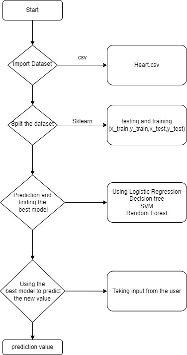
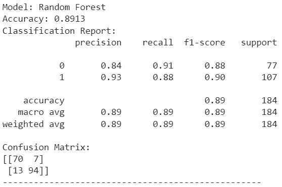
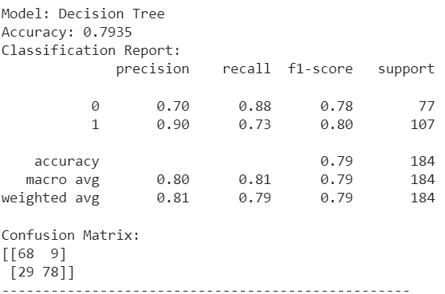
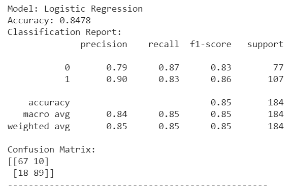
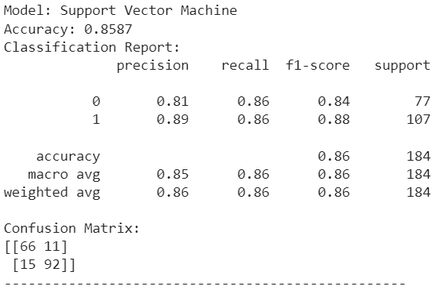
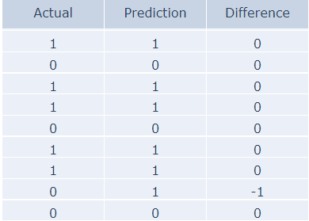
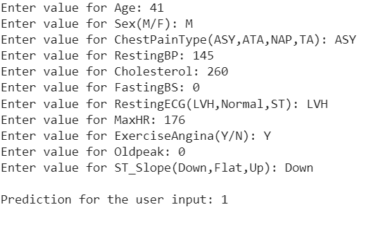

# Heart Disease Prediction

Welcome to the Heart Disease Prediction project! This repository focuses on the exploration of machine learning algorithms to predict and understand heart disease, with a special emphasis on the often overlooked 18-25 age group. 

## Dataset
This project utilizes the heart failure prediction dataset from Kaggle, available [here](https://www.kaggle.com/datasets/fedesoriano/heart-failure-prediction). The dataset provides a comprehensive set of features for predicting heart failure, forming the foundation for our explorations.

## Project Brief


Workflow:
Data Splitting:

We partition the dataset into training and testing subsets to evaluate model performance effectively.

Model Training:
We are employing Random Forest, Decision Tree, Support Vector Machine, and Logistic Regression models for heart disease prediction.

Model Evaluation:
Assessing the predictive power of each model on the test set.

Identifying the Best Model:
Comparing model performances to determine the most effective predictor.

Live Predictions:
Deploying the best model, Random Forest in this case, for predictions with real-world values.

## Deployment

To deploy this project run

First clone the repo

Then install the following libraries
```python
pip install -r requirements.txt
```
After install all the dependencies 
```bash
- open cmd and run
- python Heart_Disease.py
```

## Screenshots








## Contribution
If you have ideas for improvement or wish to contribute, please open an issue or submit a pull request. Collaboration is highly encouraged!
